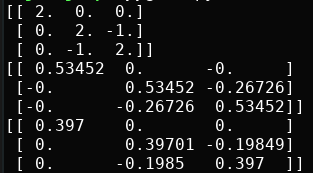
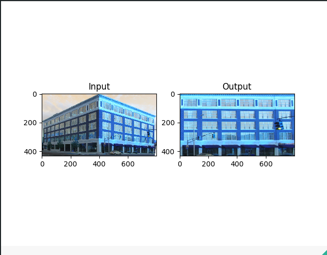

# Računanje projektivnog preslikavanja i otklanjanje distorzije

1. Naivni algoritam
2. DLT algoritam
3. Modifikovani DLT algoritam (sa normalizacijom)
4. Aplikacija koja učitava sliku, korisnik bira mišem 4 piksela koji se slikaju u pravougaonik a aplikacija vraća sliku sa otklonjenom projektivnom distorzijom


Rezultat rada algoritama

Rezultat rada aplikacije

## Pokretanje
```bash
python main.py
```

Za promenu slike, promeniti putanju na liniji 8 u main.py file-u